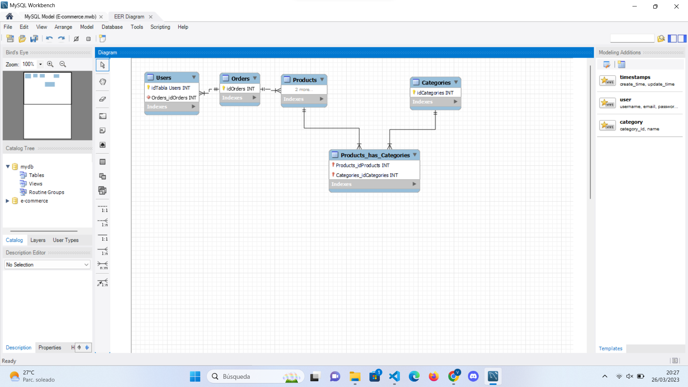

<!-- 2.2. Ejecute las siguientes consultas SQL -->

<!-- 2.2.1 INSERTAR DATOS -->

<!-- Inserte al menos 5 nuevos usuarios. -->

INSERT INTO Users (name) 
VALUES 
('Laura'),
('Javier'),
('Carolina'),
('Fernando'),
('Adriana');

<!-- Inserte al menos 5 nuevos productos. -->

INSERT INTO Products (name) 
VALUES 
('Camisa de algodón'),
('Jeans azules'),
('Zapatos deportivos'),
('Bolso de cuero'),
('Pulsera dorada');

<!-- Inserte al menos 5 nuevos pedidos(orders). -->

INSERT INTO Orders (id_users, date, price) 
VALUES 
(1, '2023-03-25', 150.00),
(2, '2023-03-25', 250.00),
(3, '2023-03-26', 80.00),
(4, '2023-03-26', 175.00),
(5, '2023-03-26', 50.00);

<!-- Inserte al menos 2 tipos de categorías. -->

INSERT INTO Categories (name)
VALUES 
('Ropa'),
('Complementos');

<!-- 2.2.2 ACTUALIZAR DATOS -->

UPDATE Products
SET name = 'Camisa de algodón premium'
WHERE id = 1;

<!-- Cambiar el precio de un producto a 50€. Para ello, genera una consulta que afecte solo a un determinado producto en función de su  id. -->

UPDATE Products
SET price = 50
WHERE id = 1;

<!-- 2.2.3 OBTENER DATOS -->

<!-- Seleccione todos los productos con un precio superior a 20€.
Muestre de forma descendente los productos. -->

SELECT * 
FROM Products 
WHERE price > 20 
ORDER BY precio DESC;

<!-- Seleccione todos los productos y que muestre la categoría a la que pertenecen. -->

SELECT Products.*, Categories.name as Ropa
FROM Products
JOIN Categories ON Products.id_Ropa = Categories.id;

<!-- Seleccione todos los usuarios y muestre sus pedidos. -->

SELECT Users.*, Orders.*
FROM Users
LEFT JOIN Orders ON Users.id = Orders.id_name;

<!-- Selecciona un producto por su id y que muestre la categoría a la que pertenece. -->

SELECT Products.*, Categories.name as Ropa
FROM Products
JOIN Categories ON Products.id_Ropa = Categories.id
WHERE Products.id = 1;

<!-- Seleccione a un usuario por su id y muestre los pedidos que tiene. -->

SELECT Users.*, Orders.*
FROM Users
LEFT JOIN Orders ON Users.id = Orders.id_name
WHERE Users.id = 1;

<!-- 3. Extra
3.1.1 BORRAR DATOS -->

DELETE FROM Products
WHERE id = 1;

